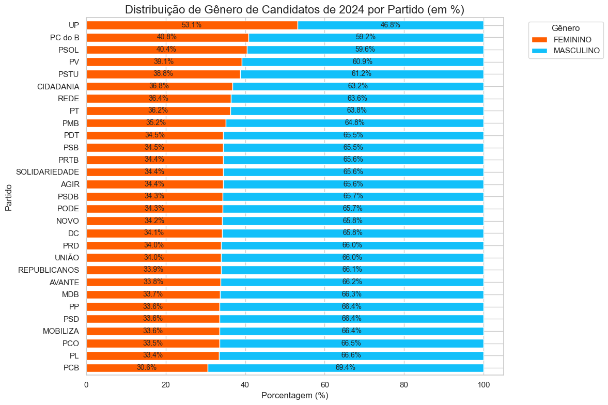

# Projeto Integrador UNIVESP 2º Semestre de 2025

## Dados abertos do TSE

### Foi coletado os seguintes dados das eleições municipais de 2024

[Candidatos](https://dadosabertos.tse.jus.br/dataset/candidatos-2024/resource/af76c401-0972-4ddf-8ea8-00e310ae53b4)

[Resultados - Votação nominal por município e zona](https://cdn.tse.jus.br/estatistica/sead/odsele/votacao_candidato_munzona/votacao_candidato_munzona_2024.zip)

[Eleitorado](https://cdn.tse.jus.br/estatistica/sead/odsele/perfil_eleitorado/perfil_eleitorado_2024.zip)

### Foi coletado os seguintes dados das eleições estaduais e federais de 2022

[Candidatos](https://cdn.tse.jus.br/estatistica/sead/odsele/consulta_cand/consulta_cand_2022.zip)

[Resultados - Votação nominal por município e zona](https://cdn.tse.jus.br/estatistica/sead/odsele/votacao_candidato_munzona/votacao_candidato_munzona_2022.zip)

[Eleitorado](https://cdn.tse.jus.br/estatistica/sead/odsele/perfil_eleitorado/perfil_eleitorado_2022.zip)

## Gráficos

Em construção...
